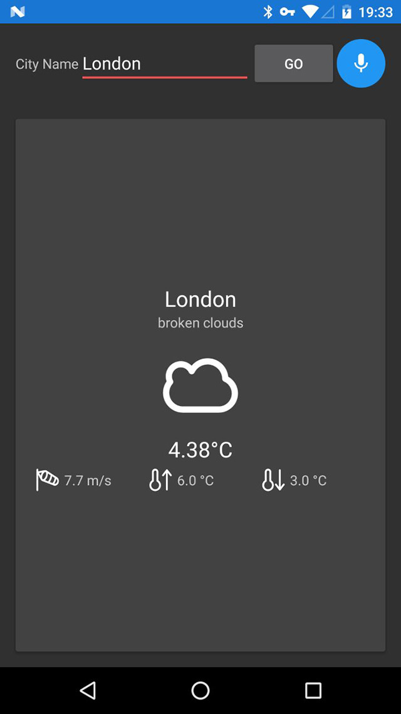
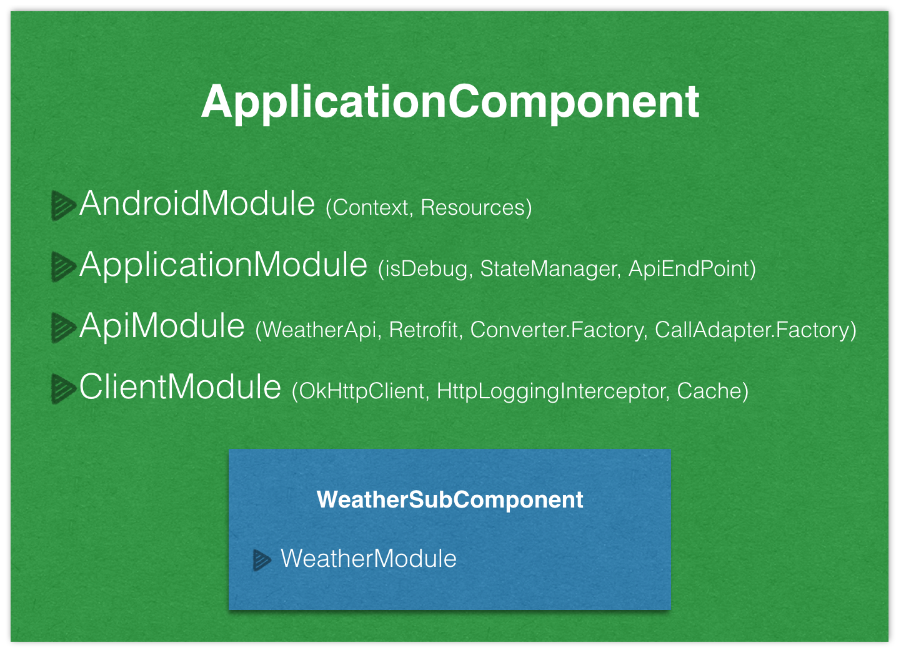

Autolabs Application  
===============================

This repository holds the source code of the Weather Android Application, a simple Android client for the [Open Weather Map](http://openweathermap.org).
This application was created by [Mohsen Mirhoseini Argi](http://mirhoseini.com), as part of the technical assessment by the [German Auto Labs GAL GmbH](https://www.germanautolabs.com) team.

--------------------
### What is this repository for? ###

* Autolabs Application
*       Version:  1.0
* Last Update: Wed Jan 4, 2017

--------------------
### Development Tools ###

* Android Studio v2.2.3
* gradle-plugin v2.2.3
* Android SDK Build Tools v25.0.0
* MinSdkVersion 9
* CompileSDKVersion 25
* Retrolambda v3.3.1

--------------------
### Dependencies ###

* Android Support Tools (recyclerView, cardView, vector,... ) v25.0.1
* Retrofit v2.1.0
* OkHttp v3.4.1
* Dagger v2.8
* RxJava v1.2.3
* RxAndroid v1.2.1
* ButterKnife v8.4.0
* Timber v4.3.1
* AndroidUtils v1.0.7
* jUnit v4.12
* Android Support Test v0.5
* Mockito v1.10.19
* Robolectric v3.1-rc1
* Espresso v2.2.2

--------------------
### Important Notes ###

The application has on Activity, MainActivity. The MainActivity is consist of a search UI and a Fragment, WeatherFragment, which is responsible for presenting searched city current weather.

All activity lifecycle and network behaviours are implemented, and according to device size and network situation user get a good UI and UX. If no internet connection or network error, a Snackbar pops up and ask user to turn on network connection or retry.

Some simple Test Cases was designed to test application UI functionality and core classes using jUnit and AndroidUnitTest.

### Application Structure ###

The Application implemented and structured bases on the MVP pattern best practice, contributed by [Antonio Leiva](http://antonioleiva.com/mvp-android/).

Whole application functionality is implemented in "Core-Lib" module using pure Java. The "App" module contain all codes required for Android Application to load on Android OS, which can be replace by any other interface (e.g. console app or web app). You can read more about my method in this article published by me on [hackernoon.com](https://hackernoon.com/yet-another-mvp-article-part-1-lets-get-to-know-the-project-d3fd553b3e21#.h18h1lefy)

The **view** (MainActivity), contain one fragment. WeatherFragment contain its own presenter and implement View interfaces and the only thing that the view will do is calling a method from the presenter every time there is an interface action.

The **presenter** (WeatherPresenters, is responsible to act as the middle man between view and model. It retrieves data from the Model and returns it formatted to the view. It also decides what happens when user interact with the view.

The **models** (WeatherInteractor), would only be the gateway to the service domain layer or business logic. In this case it provide the data needed to be displayed in the view from Network.

The networking and API call are managed by [Retrofit](http://square.github.io/retrofit/) and OkHttp as its httpclient, contributed by [Square](http://square.github.io). It also shows decent logs while application is running in Debug mode. 

Layers communications are managed by [RxJava](https://github.com/ReactiveX/RxJava) & [RxAndroid](https://github.com/ReactiveX/RxAndroid) contributed by [ReactiveX](http://reactivex.io).

Dependency Injections are being managed by [Dagger](https://github.com/google/dagger) created by [Square](http://square.github.io) and now maintained by [Google](http://google.github.io/dagger/).

It was my first experience with Speech Recognition Applications, so after a research I prefered to use Android SpeechRecognizer service, however, I know that this part is not so professional and require more changes.  

Some minor Android common functions are managed using [AndroidUtils](https://github.com/mmirhoseini/android_utils) library, developed and published on jCenter by [myself](http://mirhoseini.com).

Whole projects Dependencies are placed in "libraries.gradle" to avoid version conflicts and redundant in different modules.

Used new SupportVector library in some icons cases for a better UI.

Used new DataBinding library contributed by Google in Adapters for faster development, and added CustomBindingAdapter to replace API weather icons with in-app Vector assets for a better UI.

The Android Log system is replaced with [Timber](https://github.com/JakeWharton/timber) contributed by Jake Wharton, which avoid logging in release version.

Sample test cases are implemented by mockito, espresso, robolectric and mocking dagger.

Finally, used [circleci](https://circleci.com/gh/mmirhoseini/Android-coding-challenge) and [travis ci](https://travis-ci.org/mmirhoseini/Android-coding-challenge) as Continues Integration services which are bind with [Github](https://github.com/mmirhoseini/Android-coding-challenge) repo.